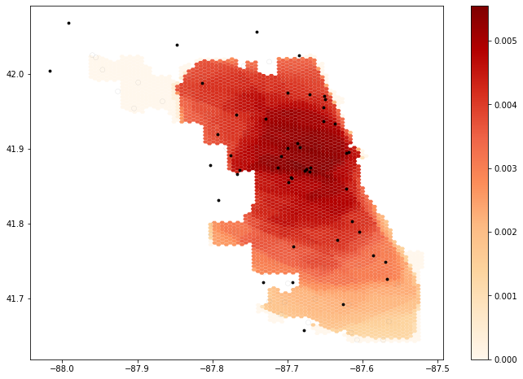
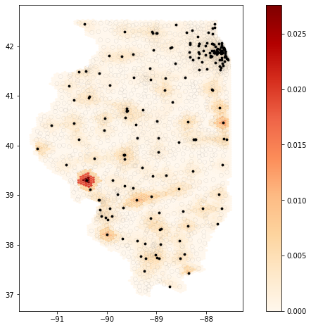

# Spatial Accessibility to ICU Beds and Ventilators in Illinois

    
    

**Authors:** Jeon-Young Kang & Alexander Michels

**Abstract:** This aims to measure spatial access for people to hospitals in Illinois. The spatial accessibiilty is measured by the use of an enhanced two-step floating catchment area (E2FCA) method (Luo & Qi, 2009), which is an outcome of interactions between demands (i.e, # of potential patients; people) and supply (i.e., # of beds or physicians). The result is a map of spatial accessibility to hospital beds. It identifies which regions need more healthcare resources, such as the number of ICU beds and ventilators. This notebook serves as a guideline of which areas need more beds in the fight against COVID-19.
